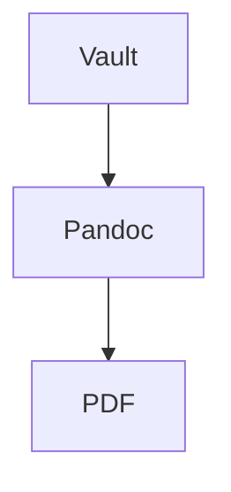

# Obsi Print

Obsi Print turns Obsidian notes into publication-ready PDFs through a Docker-based Pandoc/LaTeX pipeline. You write in Obsidian, keep your notes modular, and export a polished PDF without installing a local TeX distribution.

## What Obsi Print does

Obsi Print keeps the Obsidian authoring model intact and adds the parts that are usually painful to wire up by hand: PDF export, numbering, cross-references, glossaries, branding, citation handling, and LaTeX-backed structured blocks.

The core authoring model is **atomic**. Chapters, theorems, tables, glossary entries, diagrams, and other reusable content blocks live in their own notes and are embedded into a main document.

***

## Install

At a high level, the setup is simple:

1. Install Docker.
2. Install the Obsi Print plugin.
4. Export the active note to PDF.

The first build prepares the full toolchain, including the download and build of the Docker Image. After that, PDF export is a regular command from the Obsidian command palette.

***

## Recommended workflow

Obsi Print works best when you treat your vault like a set of reusable building blocks instead of one long monolithic document.

A typical workflow looks like this:

1. Create one short main document.
2. Put each chapter in its own note.
3. Put each reusable structured element in its own note, for example a theorem, table, equation, glossary entry, or Mermaid diagram.
4. Embed these notes into the main document with normal Obsidian wikilink embeds.
5. Refer to embedded content with normal wikilinks.
6. Export the main document to PDF.

This keeps the source material maintainable, reusable, and easy to rearrange.

***

## Main document structure

A main document is usually short. It mostly contains frontmatter and embeds.

Example:

```markdown
---
title: "My Report"
toc: true
---

![[Chapter-Introduction]]
![[Chapter-Theory]]
![[Chapter-Results]]
```

This is the central idea of Obsi Print: the main file acts as composition, while the actual content lives in reusable notes.

***

## Feature overview

### Atomic notes

Atomic notes are the foundation of the plugin. Instead of writing one huge export note, you split content into small units that each represent one concept.

Good candidates for atomic notes include:

- Chapters
- Theorems and definitions
- Tables
- Equations
- Glossary entries
- Mermaid diagrams
- Reusable image figures

This structure makes it easier to reuse content across multiple documents and reduces maintenance overhead when parts of a document change.

### Embedded notes

Obsi Print uses normal Obsidian embed syntax to assemble documents.

Supported patterns:

- `![[Note]]` embeds a full note.
- `![[Note#Heading]]` embeds a section starting at a heading.
- `![[Note#^block-id]]` embeds a block slice.

### Auto heading shift

Embedded notes should start with a normal `# Heading`. Obsi Print automatically shifts heading depth based on where the note is embedded.

That means embedded content can keep a clean, local structure without forcing you to manually rewrite heading levels for every context.

### Cross-references from normal wikilinks

Normal wikilinks are turned into PDF references when the target is embedded in the exported document.

Typical behavior:

- `[[Note]]` becomes an automatic reference such as a theorem, table, figure, or equation reference.
- `[[Note|Custom Text]]` becomes a hyperlink with custom link text.
- If a target is not embedded, the link falls back gracefully to plain text.

This lets you keep using familiar Obsidian links while getting proper PDF cross-references.

### Passive embeds

Passive embeds use the `+[[...]]` syntax. They behave like normal embeds during export, but remain visually compact in the Obsidian editor.

This is useful when a document contains many large chapter embeds and you want the source note to stay readable while still expanding everything in the final PDF.

### Multi-embed behavior

The same note can be embedded more than once. Obsi Print avoids the usual LaTeX label conflicts by assigning the label only on the first occurrence while still keeping counters consistent.

This is helpful when reused content appears in multiple places of the same exported document.

***

## Structured blocks with `latex-env`

Some notes are not just plain text blocks. Obsi Print can map a note to a LaTeX environment through frontmatter.

This allows structured content to stay author-friendly in Obsidian while being rendered correctly in the exported PDF.

### Theorems, lemmas, definitions, proofs

Use `latex-env` to wrap a note in a theorem-like environment.

Example:

```yaml
---
latex-env: theorem
latex-short: Pythagoras
---
```

This is ideal for mathematical or technical writing where reusable theorem-style blocks should be referenced from the surrounding text.

### Tables

A note with `latex-env: table` becomes a numbered table in the PDF. The note must include a `caption` in frontmatter.

This makes tables first-class document objects with captions, numbering, references, and list-of-tables support.

### Equations and math environments

Obsi Print supports math-focused environments such as `equation`, `align`, `gather`, `multline`, and `alignat`, including star variants.

This is useful when equations should be atomic, reusable, and cross-referenceable instead of being buried inline inside long chapter notes.

### Mermaid diagrams

Mermaid diagrams can be authored as atomic notes with `latex-env: mermaid`. The note body contains the Mermaid code block, while frontmatter supplies metadata such as the caption.

On export, the diagram is rendered into an image, numbered like a figure, and can be referenced from the surrounding text.

Optional frontmatter keys also let you control width and render resolution.

***

## Images and figures

Image embeds become figures when used with a caption.

Example:

```markdown
![[plot.png|My plot]]
![[plot.png|My plot|w=60%]]
```

Supported width hints include percentages, pixel units, metric units, and LaTeX-style widths. This makes it possible to reuse the same image at different sizes across different documents.

References with `[[plot.png]]` becomes `Abbildung X`. 

***

## Glossary and acronyms

Glossary entries are modeled as notes with glossary frontmatter. A linked glossary note will automatically become a glossary or acronym reference in the exported PDF. Link a Glossary Note with `[[GLS]]`/`[[ACN]]` an create a Note with the Frontmatter: 


`GLS.md`
```
---
gls-id: gls
gls-short: GLS
gls-long: Glossary
gls-description: Künstliches neuronales Netzwerk mit mehreren verborgenen Schichten zwischen Eingabe- und Ausgabeschicht, das komplexe Muster in Daten erkennen kann.
gls-type: acronym
---
```

`ACN.md`
```
---
gls-id: acn
gls-short: ACN
gls-long: Acronym
gls-type: term
---
```

***

## Citations and bibliography

Obsi Print supports bibliography-driven citations through Pandoc. A document can point to a `.bib` file in the vault and optionally use a CSL style.

This makes the plugin suitable for academic or technical writing workflows that already rely on tools such as Zotero and Better BibTeX.

***

## Obsidian-specific inline syntax

Obsi Print also preserves and transforms selected inline authoring patterns.

Supported examples include:

- `%%comment%%` for comments that do not appear in the PDF
- `==highlight==` for highlighted text
- Obsidian callouts mapped to PDF callout styling

This helps preserve the convenience of writing in Obsidian without losing control over the final document output.

***

## Branding

Branding is handled through a dedicated branding note and regular frontmatter overrides. This keeps document styling configurable without hardcoding project-specific values into the content itself.

A branding note can control items such as:

- Title page behavior
- Logos
- Header and footer content
- Colors and template metadata
- Other Pandoc and Eisvogel options

The branding note is activated from the document frontmatter via `obsi-print-branding`.

### Logos in headers and footers

Logo paths can be managed through branding metadata. Header and footer logo slots are designed for easy per-project customization.

This is useful for customer-specific reports, institutional templates, or multi-brand documentation workflows.

### Branding overrides per document

Defaults can come from the plugin configuration, while a branding note and the document frontmatter can override specific values.

This layered approach gives you a stable baseline and still allows document-level customization when needed.

***

## Table of contents and generated lists

Obsi Print supports document metadata such as a table of contents, list of figures, and list of tables.

That makes it practical for longer reports or formal deliverables where navigation and generated lists are expected.

***

## Commands

The plugin exposes several commands through the Obsidian command palette.

### Export active note to PDF

This is the main command. It runs the document through the containerized export pipeline and writes the resulting PDF.

### Build Docker image

This command builds the Docker image used by the export pipeline. You typically need it for the first run and after environment-related changes.

### Create branding template

This command creates a branding template note in the vault. It is a quick way to start a new brand configuration without copying old project files by hand.

### Remove Docker image

This command removes the pipeline image. The next export can then rebuild the environment from scratch.

### Cleanup build folder

This command clears the build folder used during export. It is mainly useful for maintenance and debugging.

***

## AI skill integration

Obsi Print can install a dedicated authoring skill into the vault. The goal is to help AI tools follow the plugin's writing conventions when generating or editing exportable notes.

This is particularly useful when AI is used for report drafting, technical writing, or vault-assisted authoring.

***

## Typical examples

### Example: theorem note

```markdown
---
latex-env: theorem
latex-short: Pythagoras
---
# Pythagoras

$a^2 + b^2 = c^2$
```

Embedded elsewhere:

```markdown
![[Theorem-Pythagoras]]

From [[Theorem-Pythagoras]] we have ...
```

### Example: Mermaid note

````markdown
---
latex-env: mermaid
caption: "Data flow from vault to PDF"
---
# Data Flow


````

### Example: glossary note

```yaml
---
gls-id: ki
gls-short: KI
gls-long: Künstliche Intelligenz
gls-type: acronym
---
```

***

## Best practices

- Keep one concept per note.
- Keep chapters in their own files.
- Start atomic notes with a normal H1 heading.
- Add captions to tables, Mermaid diagrams, and figures.
- Use standard Obsidian links and embeds instead of inventing custom syntax.
- Use branding notes for project-specific output settings.
- Use passive embeds when the editor view gets too crowded.

***

## Common mistakes

- Writing one giant export note instead of composing from atomic notes.
- Manually adjusting heading levels inside embedded notes.
- Embedding images without captions when figure numbering is expected.
- Using Mermaid inline in arbitrary notes instead of a dedicated diagram note.
- Forgetting required frontmatter such as `caption` for tables and Mermaid notes.
- Mixing project styling directly into content instead of using branding metadata.

***

## Git-friendly documentation conventions

This documentation is intended to live well in a Git repository.

Recommended conventions:

- Keep all documentation in plain Markdown.
- Store GIFs under `docs/assets/gifs/`.
- Use stable relative paths for media.
- Keep one feature per section so diffs stay small.
- Prefer short code examples over large copied files.
- Avoid screenshots with embedded text when a short GIF or code block communicates the feature better.

Suggested repo layout:

```text
docs/
├── obsi-print-human-docs.md
└── assets/
    └── gifs/
        ├── install-and-first-build.gif
        ├── atomic-workflow-overview.gif
        ├── feature-atomic-notes.gif
        └── ...
```

***

## Scope of this document

This document is the human-facing usage guide. It explains how to work with Obsi Print as an author.

Implementation details, internal pipeline behavior, and maintenance notes belong in a separate developer handover document.