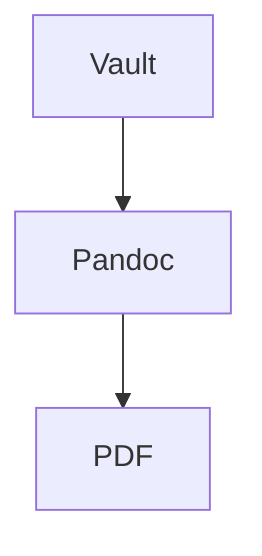

# Obsi Print

Obsi Print turns Obsidian notes into publication-ready PDFs through a Docker-based Pandoc/LaTeX pipeline. You write in Obsidian, keep your notes modular, and export a polished PDF without installing a local TeX distribution.

## What Obsi Print does

Obsi Print keeps the Obsidian authoring model intact and adds the parts that are usually painful to wire up by hand: PDF export, numbering, cross-references, glossaries, branding, citation handling, and LaTeX-backed structured blocks.

The core authoring model is **atomic**. Chapters, theorems, tables, glossary entries, diagrams, and other reusable content blocks live in their own notes and are embedded into a main document.

***

## Install

> **Requirements:** Docker must be installed **and on your `PATH`** — the plugin invokes `docker` directly. (The plugin augments `PATH` with common install locations so launching Obsidian from the GUI still works, but a non-standard Docker install must be reachable via `PATH`.)
>
> **Platform support:** Only **macOS** is tested. Windows and Linux are **experimental and currently untested** — they may not work yet. Feedback and reports from those platforms are very welcome.

At a high level, the setup is simple:

1. Install Docker.
2. Install the Obsi Print plugin.
3. Export the active note to PDF.

The first export prepares the full toolchain, including the download and build of the Docker image. Alternatively you can build the image in the Settings or via the command palette. PDF export is a regular command from the Obsidian command palette.

### Install the plugin

Community Store: pending.

Until then, via [BRAT](https://github.com/TfTHacker/obsidian42-brat):

1. Install BRAT.
2. Add beta plugin: `MrIwan/obsi-print`.
3. Enable Obsi Print.

Requires Docker. First export builds the image.

***

## Recommended workflow

Obsi Print works best when you treat your vault like a set of reusable building blocks instead of one long monolithic document.

A typical workflow looks like this:

1. Create one short main document.
2. Put each chapter in its own note.
3. Put each reusable structured element in its own note, for example a theorem, table, equation, glossary entry, or Mermaid diagram.
4. Embed these notes into the main document with normal Obsidian wikilink embeds.
5. Refer to embedded content with normal wikilinks.
6. Export the main document to PDF.

This keeps the source material maintainable, reusable, and easy to rearrange.

### Example

```text
Vault/
├── Report.md              # main document
├── Chapter-Introduction.md
├── Chapter-Theory.md
├── Theorem-Pythagoras.md
└── Table-Results.md
```

***

## Main document structure

A main document is usually short. It mostly contains frontmatter and embeds.

The main file acts as composition, while the actual content lives in reusable notes.

### Example

```markdown
---
title: "My Report"
toc: true
---

![[Chapter-Introduction]]
![[Chapter-Theory]]
![[Chapter-Results]]
```

***

## Feature overview

### Atomic notes

Atomic notes are the foundation of Obsidian. Instead of writing one huge export note, you split content into small units that each represent one concept.

Good candidates for atomic notes include:

- Chapters
- Theorems and definitions
- Tables
- Equations
- Glossary entries
- Mermaid diagrams
- Reusable image figures

This structure makes it easier to reuse content across multiple documents and reduces maintenance overhead when parts of a document change.

### Embedded notes

Obsi Print uses normal Obsidian embed syntax to assemble documents.

Supported patterns:

- `![[Note]]` embeds a full note.
- `![[Note#Heading]]` embeds a section starting at a heading.
- `![[Note#^block-id]]` embeds a block slice.

#### Example

```markdown
![[Chapter-Theory]]
![[Chapter-Theory#Background]]
![[Chapter-Theory#^key-result]]
```

### Auto heading shift

Embedded notes should start with a normal `# Heading`. Obsi Print automatically shifts heading depth based on where the note is embedded.

That means embedded content can keep a clean, local structure without forcing you to manually rewrite heading levels for every context.

### Cross-references from normal wikilinks

Normal wikilinks are turned into PDF references when the target is embedded in the exported document.

Typical behavior:

- `[[Note]]` becomes an automatic reference such as a theorem, table, figure, or equation reference.
- `[[Note|Custom Text]]` becomes a hyperlink with custom link text.
- If a target is not embedded, the link falls back gracefully to plain text.

This lets you keep using familiar Obsidian links while getting proper PDF cross-references.

### Passive embeds

Passive embeds use the `+[[...]]` syntax. They behave like normal embeds during export, but remain visually compact in the Obsidian editor.

This is useful when a document contains many large chapter embeds and you want the source note to stay readable while still expanding everything in the final PDF.

***

## Structured blocks with `latex-env`

Some notes are not just plain text blocks. Obsi Print can map a note to a LaTeX environment through frontmatter.

This allows structured content to stay author-friendly in Obsidian while being rendered correctly in the exported PDF.

### Theorems, lemmas, definitions, proofs

Use `latex-env` to wrap a note in a theorem-like environment.

This is ideal for mathematical or technical writing where reusable theorem-style blocks should be referenced from the surrounding text.

#### Example

`Theorem-Pythagoras.md`:

```markdown
---
latex-env: theorem
latex-short: Pythagoras
---
# Pythagoras

$a^2 + b^2 = c^2$
```

Embedded elsewhere:

```markdown
![[Theorem-Pythagoras]]

From [[Theorem-Pythagoras]] we have ...
```

### Tables

A note with `latex-env: table` becomes a numbered table in the PDF. The note must include a `caption` in frontmatter.

This makes tables first-class document objects with captions, numbering, references, and list-of-tables support.

#### Example

`Table-Results.md`:

```markdown
---
latex-env: table
caption: "Measurement results"
---
# Results

| x | y |
|---|---|
| 1 | 2 |
| 3 | 4 |
```

Embedded elsewhere:

```markdown 
![[Table-Results]]

As shown in [[Table-Results]], the measurements indicate ...
```

### Equations and math environments

Obsi Print supports math-focused environments such as `equation`, `align`, `gather`, `multline`, and `alignat`, including star variants.

This is useful when equations should be atomic, reusable, and cross-referenceable instead of being buried inline inside long chapter notes.

#### Example

`Equation-Energy.md`:

```markdown
---
latex-env: align
---
# Energy

$$
E &= mc^2 \\
F &= ma
$$
```

Embedded elsewhere:

```markdown
![[Equation-Energy]]

From [[Equation-Energy]] we see that ...
```

### Mermaid diagrams

Mermaid diagrams can be authored as atomic notes with `latex-env: mermaid`. The note body contains the Mermaid code block, while frontmatter supplies metadata such as the caption.

On export, the diagram is rendered into an image, numbered like a figure, and can be referenced from the surrounding text.

Optional frontmatter keys also let you control width and render resolution.

#### Example

`Diagram-DataFlow.md`:

````markdown
---
latex-env: mermaid
caption: "Data flow from vault to PDF"
---
# Data Flow


````

Embedded elsewhere:

```markdown
![[Diagram-DataFlow]]

In [[Diagram-DataFlow]] we see the data flow from vault to PDF.
```

***

## Images and figures

Image embeds become figures when used with a caption.

Supported width hints include percentages, pixel units, metric units, and LaTeX-style widths. This makes it possible to reuse the same image at different sizes across different documents.

A reference with `[[plot.png]]` becomes `Abbildung X`.

### Example

```markdown
![[plot.png|My plot]]
![[plot.png|My plot|w=60%]]
```

***

## Glossary and acronyms

Glossary entries and acronyms are defined as atomic notes with `gls-*` frontmatter.  
When you link such a note with a normal wikilink like `[[GLS]]` or `[[ACN]]`, Obsi Print automatically turns it into the correct glossary or acronym reference in the exported PDF.

### Example

`GLS.md`:

```yaml
gls-id: gls
gls-short: GLS
gls-long: Glossary
gls-description: A glossary entry is a note that defines a term. It can be referenced from the text and will appear in the generated glossary section of the PDF with the hyperlinked description.
gls-type: term
```

`ACN.md`:

```yaml
gls-id: acn
gls-short: ACN
gls-long: Acronym
gls-description: An acronym entry is listed in the acronym section and can be referenced from the text.
gls-type: acronym
```

***

## Citations and bibliography

Obsi Print supports bibliography-driven citations through Pandoc. A document can point to a `.bib` file in the vault and optionally use a CSL style.

This makes the plugin suitable for academic or technical writing workflows that already rely on tools such as Zotero and Better BibTeX.

### Example

Document frontmatter:

```yaml
---
bibliography: refs.bib
csl: ieee.csl
---
```

In text just refer to the citation key:

```markdown
As shown by [@smith2020], the result holds.
```

***

## Obsidian-specific inline syntax

Obsi Print also preserves and transforms selected inline authoring patterns.

Supported examples include:

- `%%comment%%` for comments that do not appear in the PDF
- `==highlight==` for highlighted text
- Obsidian callouts mapped to PDF callout styling

This helps preserve the convenience of writing in Obsidian without losing control over the final document output.

### Example

```markdown
This sentence has %%a hidden note%% that does not appear in the PDF.
This sentence has ==highlighted text==.

> [!note] Important
> This callout becomes a PDF callout.
```

***

## Branding

Branding is handled through a dedicated branding note and regular frontmatter overrides. This keeps document styling configurable without hardcoding project-specific values into the content itself.

A branding note can control items such as:

- Title page behavior
- Logos
- Header and footer content
- Colors and template metadata
- Other Pandoc and Eisvogel options

The branding note is activated from the document frontmatter via `obsi-print-branding`.

### Example

Document frontmatter:

```yaml
---
obsi-print-branding: Branding-Customer-A
---
```

### Logos in headers and footers

Logo paths can be managed through branding metadata. Header and footer logo slots are designed for easy per-project customization.

This is useful for customer-specific reports, institutional templates, or multi-brand documentation workflows.

#### Example

In a branding note:

```yaml
---
header-logo: "[[logo-header.png]]"
footer-logo: "[[logo-2-footer.png]]"
---
```

### Branding overrides per document

Defaults can come from the plugin configuration, while a branding note and the document frontmatter can override specific values.

This layered approach gives you a stable baseline and still allows document-level customization when needed.

#### Example

Document frontmatter overrides selected values from the branding note:

```yaml
---
obsi-print-branding: "[[Branding-Default]]"
title: "Q4 Report"
header-color: "#003366"
---
```

In this example, the document uses the `Branding-Default` note for general styling but overrides the title and header color for this specific report.

***

## Table of contents and generated lists

Obsi Print supports document metadata such as a table of contents, list of figures, and list of tables.

That makes it practical for longer reports or formal deliverables where navigation and generated lists are expected.

### Example

```yaml
---
toc: true
lof: true
lot: true
---
```

***

## Commands

The plugin exposes several commands through the Obsidian command palette.

### Export active note to PDF

This is the main command. It runs the document through the containerized export pipeline and writes the resulting PDF.

#### Example

Open `Report.md`, run `Obsi Print: Export active note to PDF`, and the PDF is written next to the note.

### Build Docker image

This command builds the Docker image used by the export pipeline. You typically need it for the first run and after environment-related changes.

#### Example

Run `Obsi Print: Build Docker image` once after installing the plugin to prepare the toolchain.

### Create branding template

This command creates a branding template note in the vault. It is a quick way to start a new brand configuration without copying old project files by hand.

#### Example

Run `Obsi Print: Create branding template` to generate a `Branding-Template.md` you can rename and adapt for your needs.

### Remove Docker image

This command removes the pipeline image. The next export can then rebuild the environment from scratch.

#### Example

Run `Obsi Print: Remove Docker image` when a dependency update is needed; the next export rebuilds the image.

### Cleanup build folder

This command clears the build folder used during export. It is mainly useful for maintenance and debugging.

#### Example

Run `Obsi Print: Cleanup build folder` after a failed export to start the next run from a clean state.

***

## AI skill integration

Obsi Print can install a skill into the vault, where thie Obsi Print conventions are defined. The goal is to help AI tools follow the plugin's writing conventions when generating or editing exportable notes.

This is particularly useful when AI is used for report drafting, technical writing, or vault-assisted authoring.

### Example

With the skill installed, asking an AI assistant for "a new theorem note about the triangle inequality" yields an atomic note with proper `latex-env: theorem` frontmatter instead of an inline theorem buried in a chapter.

***

## License

Copyright (C) 2026 Wanja Zemke

Obsi Print is free software: you can redistribute it and/or modify it under the terms of the **GNU General Public License v3.0** as published by the Free Software Foundation, either version 3 of the License, or (at your option) any later version.

It is distributed in the hope that it will be useful, but WITHOUT ANY WARRANTY; without even the implied warranty of MERCHANTABILITY or FITNESS FOR A PARTICULAR PURPOSE. See the full license text in [LICENSE](LICENSE) for details.

***

## A note on AI assistance

Parts of this codebase were written with the help of Claude. Everything was reviewed, tested, and understood before being committed.