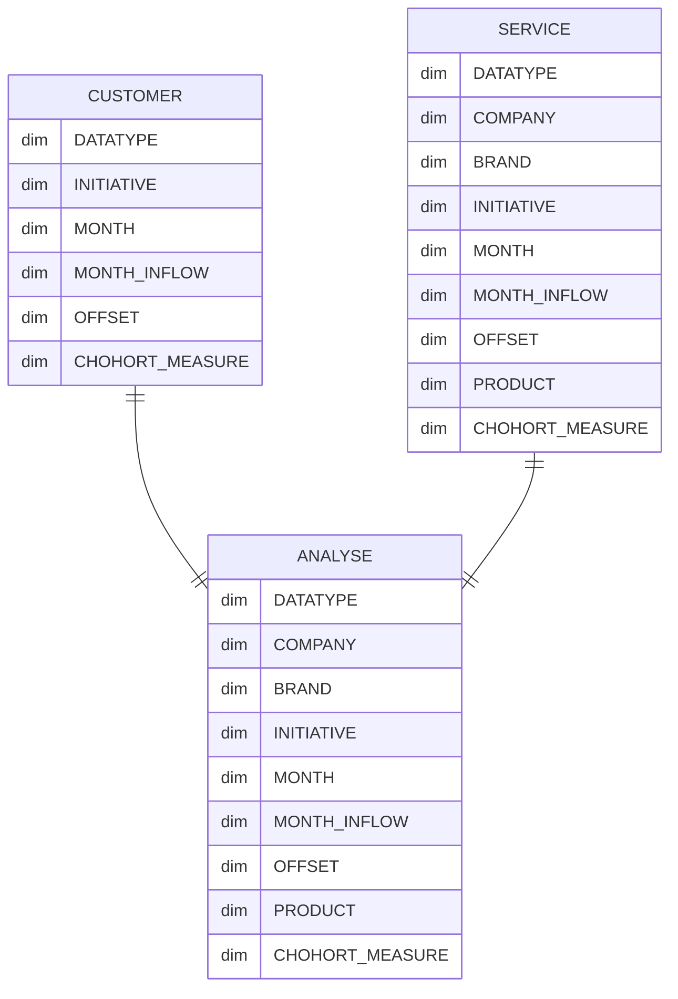

```mermaid
erDiagram
    CUSTOMER ||--|| ANALYSE : ""
    SERVICE ||--|| ANALYSE : ""
    ANALYSE {
        dim DATATYPE
        dim COMPANY
        dim BRAND
        dim INITIATIVE
        dim MONTH
        dim MONTH_INFLOW
        dim OFFSET
        dim PRODUCT
        dim CHOHORT_MEASURE
    }
    CUSTOMER {
        dim DATATYPE
        dim INITIATIVE
        dim MONTH
        dim MONTH_INFLOW
        dim OFFSET
        dim CHOHORT_MEASURE
    }
    SERVICE {
        dim DATATYPE
        dim COMPANY
        dim BRAND
        dim INITIATIVE
        dim MONTH
        dim MONTH_INFLOW
        dim OFFSET
        dim PRODUCT
        dim CHOHORT_MEASURE
    }
```
