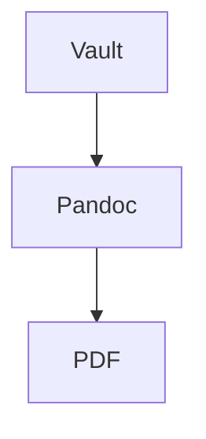

# obsi-print — Schreibkonvention

obsi-print exportiert Obsidian-Notes über eine Pandoc/LaTeX-Pipeline zu PDF. Die Konvention ist atomic: jedes Konzept (Theorem, Tabelle, Glossar-Eintrag, größere Definition) **und jedes Kapitel** bekommt eine eigene `.md`-Datei und wird per Wikilink-Embed in Hauptdokumente eingebunden. Hauptdokumente sind kurz und bestehen primär aus Frontmatter und `![[Embeds]]`. Cross-Refs zeigen automatisch auf die richtige Nummer („Theorem 3", „Tabelle 5", „Abbildung 2", „Gleichung 1").

**Atomic Notes starten immer mit H1** (`# Titel`). Der Auto-Heading-Shift verschiebt H1 beim Embed automatisch auf die passende Tiefe relativ zum Host-Heading. Du musst Header in Embeds nie von Hand anpassen.

## Frontmatter-Keys

### `latex-env` — strukturierte Blöcke

Setzt eine embedded Note in eine LaTeX-Environment.

`theorem`, `lemma`, `definition`, `proof`, plus eigene amsthm-Environments → Voll-Embed wird zu `\begin{<env>}[<latex-short>]…\end{<env>}` gewrapt. `\autoref` liefert „Theorem N" etc.

`table` → erfordert zusätzlich `caption:` im Frontmatter (sonst harter Filter-Error). Body enthält genau eine Pandoc-Tabelle. Refs liefern „Tabelle N".

`mermaid` → erfordert zusätzlich `caption:` im Frontmatter (sonst harter Filter-Error). Body enthält genau einen ```mermaid-Codeblock — Obsidian rendert die Note im Live-Preview als Diagramm, der Export ruft `mmdc` (mermaid-cli) im Container auf und ersetzt den Block durch ein nummeriertes Image mit Caption. Refs liefern „Abbildung N". Optional `w:` (oder ausgeschrieben `width:`) im Frontmatter zum Skalieren — Prozent, px, cm, mm oder LaTeX-Längen wie `0.6\textwidth`. Identische Diagramm-Sources werden gecacht — dasselbe Diagramm in mehreren Docs kostet nur einen Render.

`equation`, `align`, `gather`, `multline`, `alignat` und deren Stern-Varianten → Voll-Embed mit genau einem `$$…$$`-Block im Body. `align`/`gather` dürfen `&` und `\\` enthalten (eine Nummer pro Zeile). `equation` kann via inneres `aligned` mehrzeilig sein (eine Nummer für den ganzen Block). Fehlender Math-Block → harter Filter-Error. Refs liefern „Gleichung N".

### `caption`

Mandatory bei `latex-env: table` und `latex-env: mermaid`. Wird als Caption gerendert und im Tabellen- bzw. Abbildungsverzeichnis aufgeführt.

### `latex-short`

Optional bei Theorem-Family-Envs. Wird als optionales Argument an die Environment übergeben (`\begin{theorem}[<latex-short>]…`). Praktisch für Kurz-Bezeichner im Theorem-Header.

### Glossary-Atoms

Eine Glossar-Note ist eine `.md` mit folgenden Frontmatter-Keys:

```yaml
---
gls-id: ki                          # eindeutige LaTeX-ID
gls-short: KI                       # Kurzform
gls-long: Künstliche Intelligenz    # Langform
gls-description: ""                 # optional
gls-type: acronym                   # acronym | term
---
```

`acronym` landet im Abkürzungsverzeichnis, `term` im Glossar. Wikilinks auf die Note (`[[KI]]`) werden zu `\gls{ki}`.

### `obsi-print-branding`

Optional. Wikilink (quoted!) auf eine Branding-Note. Ohne den Key gelten die Plugin-Defaults aus `_base.yml`.

```yaml
obsi-print-branding: "[[Branding-Kunde1]]"
```

### Pandoc-/Eisvogel-Keys

Übliche Pandoc- und Eisvogel-Keys (`lang`, `toc`, `toc-depth`, `lof`, `lot`, `titlepage`, `titlepage-logo`, `header-left`, …) funktionieren wie gewohnt im Doc-Frontmatter, in der Branding-Datei oder als Plugin-Default. Doc-Frontmatter > Branding > `_base.yml`.

## Wikilink-Embeds (`![[…]]`)

`![[Note]]` — vollständige Note embedden. `.md`-Extension ist optional.

`![[Note#Heading]]` — Slice ab Heading bis zum nächsten Heading gleicher oder höherer Ebene.

`![[Note#^block-id]]` — Slice ab Block-ID.

Im Host-Dokument den Embed unter dem gewünschten Heading platzieren — der Auto-Heading-Shift macht den Rest.

### Image-Embeds

Bilder werden **immer mit Caption** embedded. Ohne Caption keine Figure-Nummerierung und kein Eintrag im Abbildungsverzeichnis.

```markdown
![[bild.png|Caption]]                    # Standard: nummerierte Figure mit Caption
![[bild.png|Mein Diagramm|w=60%]]        # mit Width-Hint
```

`|w=<wert>` akzeptiert Prozent, `px`, `cm`, `mm`, oder LaTeX-Längen wie `0.5\textwidth`. Width gilt pro Embed — dasselbe Bild kann mehrfach in verschiedenen Größen embedded werden. Der Width-Marker muss am Caption-Ende stehen.

## Wikilink-Refs (`[[…]]`)

`[[Note]]` (Default-Display) → `\autoref{label}`, ergibt „Theorem N" / „Tabelle N" / „Abbildung N" / „Gleichung N".

`[[Note|Mein Text]]` (Custom-Display) → `\hyperref[label]{Mein Text}`.

`[[GlossaryNote]]` → `\gls{<gls-id>}`, wenn die Target-Note ein `gls-id`-Frontmatter hat. Glossary gewinnt bei Konflikt mit Embed-Targets.

Refs auf Notes, die im Dokument nicht embedded sind, fallen auf Plain-Text zurück — der Linktext erscheint normal, kein Crash. Praktisch für Denk-Verweise während des Schreibens.

Bei Mehrfach-Embed derselben Note zeigt der Ref auf das erste Vorkommen (Label wird nur beim ersten Embed gesetzt; Counter zählen aber durch).

## Mermaid-Diagramme

Mermaid-Diagramme sind atomic Notes mit `latex-env: mermaid` — eine `.md` pro Diagramm. Caption ist Pflicht. Beispiel `Diagramm-Datenfluss.md`:

````markdown
---
latex-env: mermaid
caption: "Datenfluss von Vault zu PDF"
---

# Datenfluss


````

Im Hauptdokument einbinden wie jedes andere Atomic-Diagramm:

```markdown
![[Diagramm-Datenfluss]]
```

Refs ergeben „Abbildung N":

```markdown
Wie in [[Diagramm-Datenfluss]] gezeigt …
```

Optional `w:` im Frontmatter zum Skalieren — Prozent, px, cm, mm oder LaTeX-Längen wie `0.6\textwidth` (konsistent mit `|w=…` bei Image-Embeds). Alternativ ausgeschrieben `width:`; `w:` gewinnt bei Konflikt.

```yaml
---
latex-env: mermaid
caption: "Architektur-Übersicht"
w: "60%"
---
```

Identische Diagramm-Sources werden gecacht (Hash-basiert) — ein Diagramm in mehreren Docs verwenden kostet nur einen Render. Vorteil gegenüber Inline-`mermaid`-Blöcken: Obsidian zeigt das Diagramm beim Editieren der Atomic Note live in der Preview, Caption und Cross-Ref kommen aus dem Frontmatter wie bei Tabellen, und das Diagramm ist im Vault wiederverwendbar.

Inline-`mermaid`-Blöcke direkt im Hauptdokument oder in einer beliebigen Note ohne `latex-env: mermaid`-Frontmatter werden NICHT gerendert — sie bleiben als Code-Fence im PDF. Wenn das Diagramm im PDF erscheinen soll, gehört es in eine eigene atomic Note.

## Inline-Syntax

`%%text%%` → Kommentar. Im PDF unsichtbar. Funktioniert über Leerzeilen hinweg (multi-block).

`==text==` → Highlight. Paragraph-scoped. Unbalanciertes `==` wird literal beibehalten.

## Branding-Notes

Pro Kunde/Projekt eine `.md` mit Frontmatter-Overrides. Body wird beim Export ignoriert (reine Editor-Doku). Aktivierung im Doc-Frontmatter über `obsi-print-branding`. Eine Vorlage erzeugt der Command „Create branding template".

Wikilinks im YAML **müssen quoted sein** — sonst parst YAML das als Flow-Sequence:

```yaml
titlepage-logo: "[[logo.png]]"     # richtig
titlepage-logo: [[logo.png]]       # FALSCH — YAML-Parse-Error
```

Logo-Wikilinks in Header-/Footer-Slots (`header-left`, `header-center`, `header-right`, `footer-left`, `footer-center`, `footer-right`) werden automatisch zu `\raisebox{}{\includegraphics{…}}` expandiert. Default-Höhe `0.7cm`, übersteuerbar:

```yaml
header-left: "[[logo.png|h=1.2cm]]"
```

Andere Image-Keys (`titlepage-logo`, `titlepage-background`) erwarten reine Pfade — nur Pfad-Substitution, kein `\includegraphics`-Wrap. Mixed-Mode (Text und Logo in einer Header-Zelle) bleibt manuell: User schreibt LaTeX, `[[…]]` dient als Pfad-Platzhalter.

`pdflatex` kann SVGs nicht direkt einbinden — Logos als PDF oder PNG ablegen.

## Commands (Command-Palette)

- `Export active note to PDF` — Hauptkommando.
- `Build docker image (with cache)` — manueller inkrementeller Image-Build. Initial-Build oder `--no-cache` über Settings.
- `Create branding template` — schreibt `Branding-Template.md` ins Vault-Root.
- `Remove docker image` — löscht das Pipeline-Image. Nächster Export baut neu.
- `Cleanup build folder` — leert `pipeline/build/`.

## DO / DON'T

**DO** atomic schreiben: ein Konzept = eine Note. Theoreme, Tabellen, Glossar-Einträge, größere Definitionen — jeweils eigene Datei, im Hauptdokument embedden.

**DO** jedes Kapitel in einer eigenen Note ablegen und im Hauptdokument nur per `![[…]]` einbinden.

**DO** jede atomic Note mit `# Titel` (H1) starten — der Auto-Heading-Shift verschiebt das beim Embed automatisch.

**DO** Bilder immer mit Caption embedden (`![[bild.png|Caption]]`).

**DO** Mermaid-Diagramme als atomic Note mit `latex-env: mermaid` + `caption:` ablegen — eine Note pro Diagramm, im Hauptdokument per `![[…]]` embedden.

**DO** Wikilinks im YAML quoten: `"[[logo.png]]"`.

**DO** Caption an Tabellen-Notes setzen (mandatory).

**DO** für Math-Notes genau einen `$$…$$`-Block im Body verwenden.

**DON'T** Headings im Hauptdokument manuell ans Embed anpassen — der Auto-Heading-Shift erledigt das.

**DON'T** Labels manuell setzen (`\label{}`) — das Plugin labelt Embeds automatisch.

**DON'T** SVG für Logos benutzen — pdflatex kann sie nicht. PDF/PNG.

**DON'T** Caption an Tabellen-Notes weglassen — harter Filter-Error.

**DON'T** Mermaid-Diagramme inline in eine Note kippen, die kein `latex-env: mermaid` hat — der Block bleibt dann als Code-Fence im PDF, statt gerendert zu werden.

**DON'T** Bilder ohne Caption embedden — keine Nummerierung, kein Eintrag im Abbildungsverzeichnis.

## Typisches Hauptdokument

```markdown
---
title: "Mein Bericht"
obsi-print-branding: "[[Branding-Kunde1]]"
toc: true
---

![[Kapitel-Einleitung]]

![[Kapitel-Theorie]]

![[Kapitel-Daten]]
```

Jedes Kapitel-Atom (`Kapitel-Einleitung.md`, …) startet mit `# Titel` (H1) und enthält seinen eigenen Fließtext, weitere Embeds (`![[Theorem-Pythagoras]]`, `![[Tabelle-Vergleich]]`, `![[diagramm.png|Caption]]`) und Refs (`[[KI]]`, `[[Tabelle-Vergleich]]`). Der Auto-Heading-Shift verschiebt das H1 im Embed-Kontext auf das passende Level — am Hauptdokument musst du nichts manuell anpassen.
