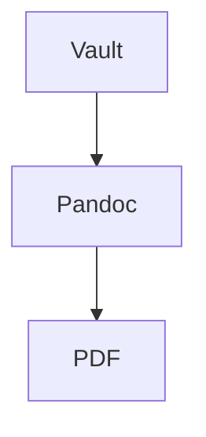

# obsi-print — authoring conventions

obsi-print exports Obsidian notes to PDF via a Pandoc/LaTeX pipeline. Authoring is **atomic**: content lives in small reusable notes that are embedded into a short main document.

## MANDATORY: atomic notes

Every structured element gets its **own `.md` note** and is pulled into a document via a wikilink embed. This is not optional. The following must **never** be written inline in a chapter or in the main document — each one is its own atomic note:

- **Every chapter**
- **Every table** (`latex-env: table`)
- **Every Mermaid diagram** (`latex-env: mermaid`)
- **Every equation / math block** (`latex-env: equation` and friends)
- **Every theorem / lemma / definition / proof** (`latex-env: theorem`, …)
- **Every glossary entry / acronym** (`gls-*` frontmatter)

Inlining any of these (e.g. a raw Markdown table, a ```mermaid fence, or a `$$…$$` block dropped directly into a chapter) breaks numbering, captions, and cross-references — and Mermaid/`latex-env` content will not render. If you are generating content, create the atomic note and embed it.

Every atomic note **starts with an H1** (`# Title`). The exporter auto-shifts heading depth on embed, so never adjust heading levels by hand.

## Main document

Short: mostly frontmatter plus embeds. Content lives in the atomic notes.

```markdown
---
title: "My Report"
toc: true
---

![[Chapter-Introduction]]
![[Chapter-Theory]]
![[Chapter-Results]]
```

## Embeds and references

- `![[Note]]` — embed a full note. `![[Note#Heading]]` — embed from a heading. `![[Note#^block-id]]` — embed a block slice.
- `+[[Note]]` — passive embed: behaves identically on export, but stays compact in the Obsidian editor. All `![[…]]` variants work with `+`.
- `[[Note]]` — reference: becomes an automatic PDF cross-reference (Theorem N, Table N, Figure N, Equation N) **when the target is embedded** in the document.
- `[[Note|Custom Text]]` — hyperlink with custom text. A reference to a non-embedded note falls back to plain text (no crash).

## `latex-env` (in the atomic note's frontmatter)

- `theorem`, `lemma`, `definition`, `proof` (+ custom amsthm envs) — wraps the note in that environment. Optional `latex-short:` becomes the environment's short title.
- `table` — **requires `caption:`**. Body holds exactly one Markdown table. Optional `page-break:` (default `true`); set `page-break: false` to keep the table on one page (must fit on a page, else it still breaks).
- `mermaid` — **requires `caption:`**. Body holds exactly one ```mermaid block. Optional `w:` (width: `60%`, `px`, `cm`, `0.6\textwidth`) and `scale:` (1–5, default 2; higher = sharper, larger PNG).
- `equation`, `align`, `gather`, `multline`, `alignat` and their `*` variants — body holds exactly one `$$…$$` block. `align`/`gather` may use `&` and `\\`.

`caption:` is mandatory for `table` and `mermaid` (hard error otherwise) and feeds the list of tables/figures.

### Examples

```markdown
---
latex-env: table
caption: "Measurement results"
page-break: false
---
# Results

| x | y |
|---|---|
| 1 | 2 |
```

````markdown
---
latex-env: mermaid
caption: "Data flow from vault to PDF"
w: "60%"
---
# Data Flow


````

## Images

Embed with a caption to get a numbered figure: `![[plot.png|My plot]]` or with a width hint `![[plot.png|My plot|w=60%]]`. Without a caption there is no figure number and no list-of-figures entry.

## Glossary and acronyms

Each term/acronym is an atomic note with `gls-*` frontmatter:

```yaml
gls-id: ki
gls-short: KI
gls-long: Künstliche Intelligenz
gls-description: ""
gls-type: acronym   # acronym → acronym list; term → glossary
```

A wikilink to such a note (`[[KI]]`) becomes the correct glossary/acronym reference.

## Citations

Point the document frontmatter at a `.bib` (and optional CSL); cite with Pandoc keys:

```yaml
---
bibliography: refs.bib
csl: ieee.csl
---
```

```markdown
As shown by [@smith2020], the result holds.
```

## Branding

Activate a branding note from the document frontmatter: `obsi-print-branding: "[[Branding-Customer-A]]"`. Wikilinks in YAML **must be quoted**. Document frontmatter overrides branding, which overrides plugin defaults.

## Inline syntax

- `%%comment%%` — hidden in the PDF.
- `==highlight==` — highlighted text.
- Obsidian callouts (`> [!note]`) map to PDF callouts.

## DO / DON'T

**DO** make every chapter, table, diagram, equation, theorem-family block, and glossary entry its own atomic note, embedded via `![[…]]`.
**DO** start every atomic note with `# Title` (H1).
**DO** set `caption:` on every `table` and `mermaid` note.
**DO** quote wikilinks in YAML.

**DON'T** inline tables, ```mermaid blocks, `$$…$$`, or theorem content directly in a chapter or the main document.
**DON'T** set `\label{}` manually — the plugin labels embeds automatically.
**DON'T** embed images without a caption if you need a figure number.
